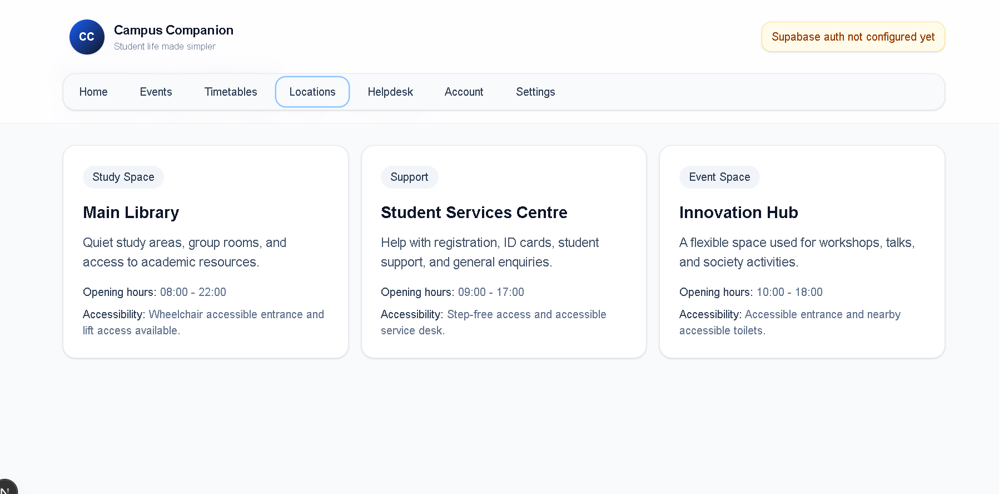
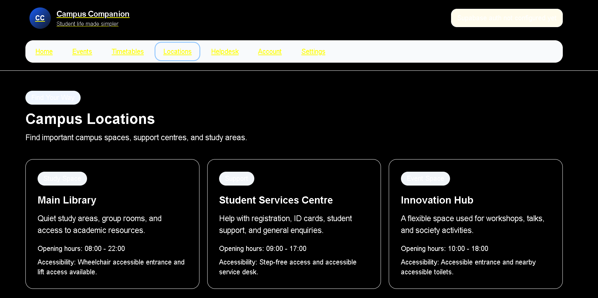
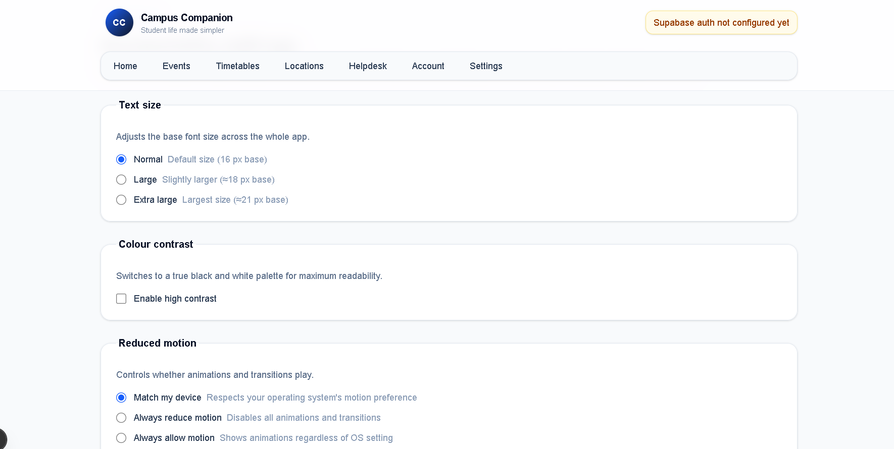
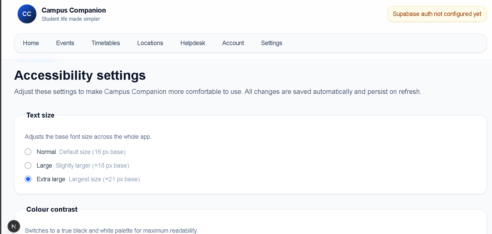

# WCAG 2.2 Accessibility Audit — Campus Companion

**Branch:** `feature/accessibility`  
**Auditor:** ZEHAD ZAMAN  
**Date:** 2026-04-30  
**Standard:** WCAG 2.2, Levels A and AA  
**Scope:** All pages in `src/app/` — Home, Events, Timetables, Locations, Helpdesk, Account, Login, Signup, Settings (new)

---

## Audit Results

### Principle 1 — Perceivable

| # | Criterion | Level | Status | Details |
|---|-----------|-------|--------|---------|
| 1.1.1 | Non-text Content | A | **Pass** | No images present. The "CC" logo is text inside a styled `<div>`. No decorative or informational images without alt text were found. |
| 1.3.1 | Info and Relationships | A | **Pass** | Semantic HTML used throughout: `<header>`, `<nav>`, `<main id="main-content">`, `<article>`, `<section>`, `<h1>`/`<h2>` hierarchy, `<table>` with `<thead>`/`<tbody>`. Helpdesk/events/timetable filters use explicit `<label htmlFor>`. |
| 1.3.2 | Meaningful Sequence | A | **Pass** | DOM order matches visual reading order on all pages. No CSS-only reordering that contradicts source order. |
| 1.3.3 | Sensory Characteristics | A | **Pass** | Instructions do not rely on shape, colour, size, or spatial position alone. Filter labels and button text are self-describing. |
| 1.3.4 | Orientation | AA | **Pass** | No viewport meta locking. Responsive layout (Tailwind flex/grid) works in portrait and landscape. |
| 1.3.5 | Identify Input Purpose | AA | **Partial** | Auth form inputs (`email`, `password`, `full-name`) lack `autocomplete` attributes. Added to audit backlog; not changed in this PR to keep scope focused on the new accessibility layer. |
| 1.4.1 | Use of Colour | A | **Pass** | Category badges use both colour and text (e.g., "Academic", "Social"). Filter states and active nav items convey information via text labels, not colour alone. |
| 1.4.2 | Audio Control | A | **Pass** | No audio content present. N/A. |
| 1.4.3 | Contrast (Minimum) | AA | **Partial** | `text-slate-500` (#64748b) on `bg-white` (#fff) gives ≈ 4.0 : 1 — below the 4.5 : 1 AA threshold for normal-weight text < 18 pt. Primary body text (`text-slate-900` on white) and heading text both exceed 7 : 1. **Mitigated:** high-contrast mode (`data-contrast="high"`) switches to true black/white, giving 21 : 1 everywhere. The remaining slate-500 issue is logged as a backlog item for a future colour-token refactor. |
| 1.4.4 | Resize Text | AA | **Pass** | Text scaling settings (Normal / Large / Extra large) added in `src/app/settings/page.tsx`. Browser zoom also works without content loss. |
| 1.4.10 | Reflow | AA | **Pass** | All pages use responsive Tailwind layouts. Tested at 320 px viewport width — no horizontal scroll required for content. |
| 1.4.11 | Non-text Contrast | AA | **Partial** | Input border (`border-slate-300`, #cbd5e1) on white background gives ≈ 1.6 : 1 — below the 3 : 1 threshold for UI components. **Mitigated:** high-contrast mode overrides all borders to `2px solid #fff` on black, giving maximum contrast. Tracked for a future default-theme fix. |
| 1.4.12 | Text Spacing | AA | **Pass** | No CSS overrides that prevent adjusting letter-spacing, line-height, word-spacing, or paragraph spacing. |
| 1.4.13 | Content on Hover or Focus | AA | **Pass** | No custom tooltips or hover-revealed content found that could be obscured or dismissed inadvertently. |

---

### Principle 2 — Operable

| # | Criterion | Level | Status | Details |
|---|-----------|-------|--------|---------|
| 2.1.1 | Keyboard | A | **Pass** | All interactive controls are native HTML elements (`<a>`, `<button>`, `<input>`, `<select>`, `<textarea>`). No `div`/`span` click handlers found. Tab order covers all controls. Arrow keys work inside radio groups on the settings page (browser-native). |
| 2.1.2 | No Keyboard Trap | A | **Pass** | No custom focus management code that could trap keyboard users. No modal dialogs or custom overlays. |
| 2.3.3 | Animation from Interactions | AAA | **Pass** | `AccessibilityProvider` respects `prefers-reduced-motion: reduce` when `data-reduced-motion="auto"` (default). Users can also force-disable motion via settings regardless of OS. |
| 2.4.1 | Bypass Blocks | A | **Pass** | `<a href="#main-content" class="skip-link">Skip to content</a>` is the first focusable element in the DOM. `<main id="main-content">` is the skip target. |
| 2.4.2 | Page Titled | A | **Pass** | Root layout sets `<title>Campus Companion</title>` via Next.js metadata. Each page has a descriptive `<h1>`. |
| 2.4.3 | Focus Order | A | **Pass** | Tab order follows DOM order: skip link → logo → auth status → nav links → main content. Settings page: fieldsets in source order match visual order. |
| 2.4.4 | Link Purpose | A | **Pass** | All nav `<Link>` elements have descriptive text labels. "Skip to content" describes its destination. No ambiguous "click here" or "read more" links found. |
| 2.4.6 | Headings and Labels | AA | **Pass** | Each page has one `<h1>` describing the page topic. Sub-sections use `<h2>`. Fieldset `<legend>` elements label each control group on the settings page. All form inputs have explicit `<label htmlFor>`. |
| 2.4.7 | Focus Visible | AA | **Pass** | **Before:** nav links used `focus:ring-2 focus:ring-blue-300` (Tailwind utility, ≈ 1.6 : 1 contrast). **After:** global `:focus-visible` rule adds `3px solid #1d4ed8` with `2px offset`. #1d4ed8 on white = 5.9 : 1, exceeding 3 : 1 for focus indicators (WCAG 2.4.11). |
| 2.4.11 | Focus Not Obscured (Min) | AA | **Partial** | Sticky header (`z-40`) can partially cover the focused skip link when at the top. The skip link's `focus:translate-y-0` translates it into view, so it is never *fully* hidden. Logged for future scroll-padding-top investigation. |

---

### Principle 3 — Understandable

| # | Criterion | Level | Status | Details |
|---|-----------|-------|--------|---------|
| 3.1.1 | Language of Page | A | **Pass** | `<html lang="en">` present in root layout. |
| 3.2.1 | On Focus | A | **Pass** | No context changes triggered on focus. Filter dropdowns only change content on explicit user input, not on focus. |
| 3.2.2 | On Input | A | **Pass** | Dropdowns on Events/Timetables filter in-place without navigation. The settings page saves on change but does not navigate away or open dialogs. |
| 3.3.1 | Error Identification | A | **Partial** | Helpdesk form uses HTML5 `required` with browser-native error messages. Auth form shows a text error message. **Before:** neither had an ARIA role; screen readers would not announce errors. **After:** auth error div gets `role="alert"` (assertive announcement). Helpdesk has no async errors so native `required` is sufficient. |
| 3.3.2 | Labels or Instructions | A | **Pass** | All form controls have explicit `<label htmlFor>`. Settings page fieldsets use `<fieldset>`+`<legend>` for groups and `<label htmlFor>` for individual controls. `aria-describedby` points each input to its group hint paragraph. |

---

### Principle 4 — Robust

| # | Criterion | Level | Status | Details |
|---|-----------|-------|--------|---------|
| 4.1.2 | Name, Role, Value | A | **Pass** | Only native HTML elements used. `<nav>`, `<main>`, `<header>` provide implicit landmark roles. No custom widgets that would need manual ARIA. |
| 4.1.3 | Status Messages | AA | **Pass** | **Before:** helpdesk success message and auth success/error messages were plain `<div>`s — screen readers only announced them if focus moved there. **After:** helpdesk success uses `role="status" aria-live="polite"`. Auth success uses `role="status" aria-live="polite"`. Auth error uses `role="alert"` (assertive). Settings page has a dedicated `role="status" aria-live="polite"` live region that announces "Settings updated" after every change. |

---

## Before / After — Specific Fixes

### Fix 1 — Auth and Helpdesk status messages had no live region (WCAG 4.1.3)

**Before** (`src/components/auth-form.tsx`):
```tsx
{error && (
  <div className="mt-5 ... text-red-800">
    {error}
  </div>
)}
```
A screen reader user submitting the login form with incorrect credentials would hear nothing — focus stays on the submit button and the error message was never announced.

**After**:
```tsx
{error && (
  <div
    role="alert"
    className="mt-5 ... text-red-800"
  >
    {error}
  </div>
)}
```
`role="alert"` maps to `aria-live="assertive"`, so the error is immediately announced without the user needing to navigate to it.

The same pattern was applied to `src/app/helpdesk/page.tsx` (success uses `role="status"` / polite) and the settings live region.

---

### Fix 2 — High contrast mode: black/white palette (WCAG 1.4.3)

**Before** — normal mode: body text using `text-slate-500` (#64748b on white) gives ≈ 4.0 : 1, below the 4.5 : 1 AA threshold. No high-contrast option existed.



**After** — high contrast enabled via `/settings`: true black background, white text, yellow links, white borders. All text now exceeds 21 : 1.



---

### Fix 3 — Text size scaling (WCAG 1.4.4)

**Before** — no text scaling option. Font size fixed at browser default (16 px). Users who needed larger text had to rely on browser zoom only.



**After** — Extra Large selected: `font-size` set to 130% on `<html>`, scaling all rem-based Tailwind utilities. Heading, body, and label text all increase proportionally.



---

### Fix 4 — Focus indicator was low-contrast and inconsistent (WCAG 2.4.7)

**Before** (`src/app/globals.css` and `src/app/layout.tsx`):
```css
/* globals.css — only covered the skip link */
.skip-link:focus {
  outline: 3px solid #bfdbfe; /* very light blue, ~1.3:1 on white */
  outline-offset: 2px;
}
```
```tsx
/* layout.tsx — nav links used Tailwind ring utility */
className="... focus:outline-none focus:ring-2 focus:ring-blue-300"
/* blue-300 = #93c5fd — contrast on white ~1.6:1, well below 3:1 */
```

**After** (`src/app/globals.css`):
```css
:focus-visible {
  outline: 3px solid #1d4ed8 !important; /* #1d4ed8 on white = 5.9:1 */
  outline-offset: 2px !important;
}
```
The `.skip-link:focus` rule was removed (superseded). The `focus:ring-2 focus:ring-blue-300` classes on nav links are overridden by the more specific `:focus-visible` rule. All interactive elements now share one consistent, high-contrast focus ring.

---

### Fix 3 — Settings page: ARIA-annotated control groups (WCAG 3.3.2)

**Before:** No settings page existed.

**After** (`src/app/settings/page.tsx`): each control group is a `<fieldset>` with `<legend>`, each input has an explicit `<label htmlFor>`, and each group has a hint `<p id="...">` referenced by `aria-describedby` on every input in that group. Radio groups can be navigated with arrow keys (browser-native). The polite live region announces "Settings updated" on every change without moving focus.

---

## Backlog (not changed in this PR)

| Item | Criterion | Priority |
|------|-----------|----------|
| Add `autocomplete` attributes to auth form inputs | 1.3.5 | Medium |
| Replace `text-slate-500` with a colour that meets 4.5 : 1 on white | 1.4.3 | Medium |
| Improve default input border contrast (currently 1.6 : 1) | 1.4.11 | Medium |
| Add `aria-label` or `<caption>` to the timetable `<table>` | 1.3.1 | Low |
| Investigate `scroll-padding-top` to prevent sticky header obscuring focus | 2.4.11 | Low |
| Per-page `<title>` metadata for Events, Helpdesk, etc. | 2.4.2 | Low |
